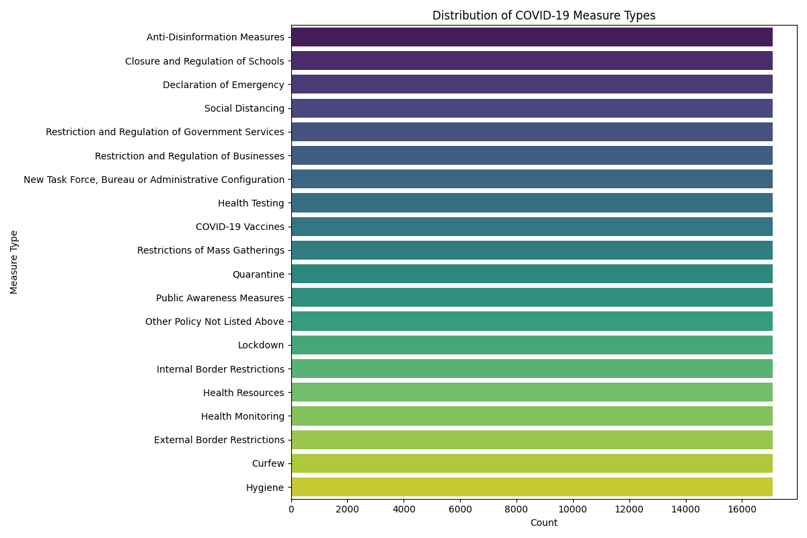
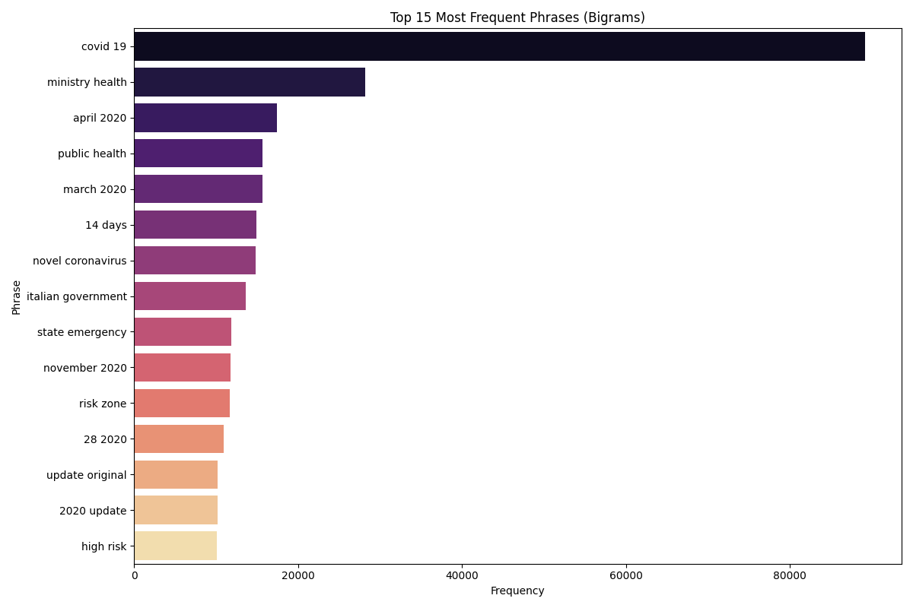
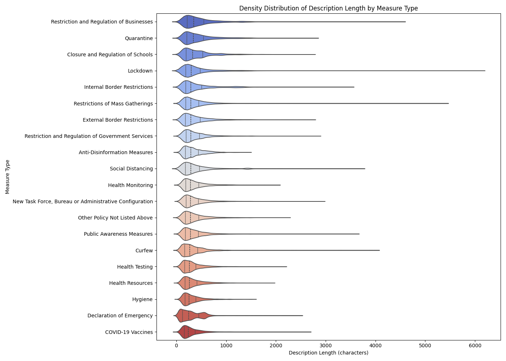
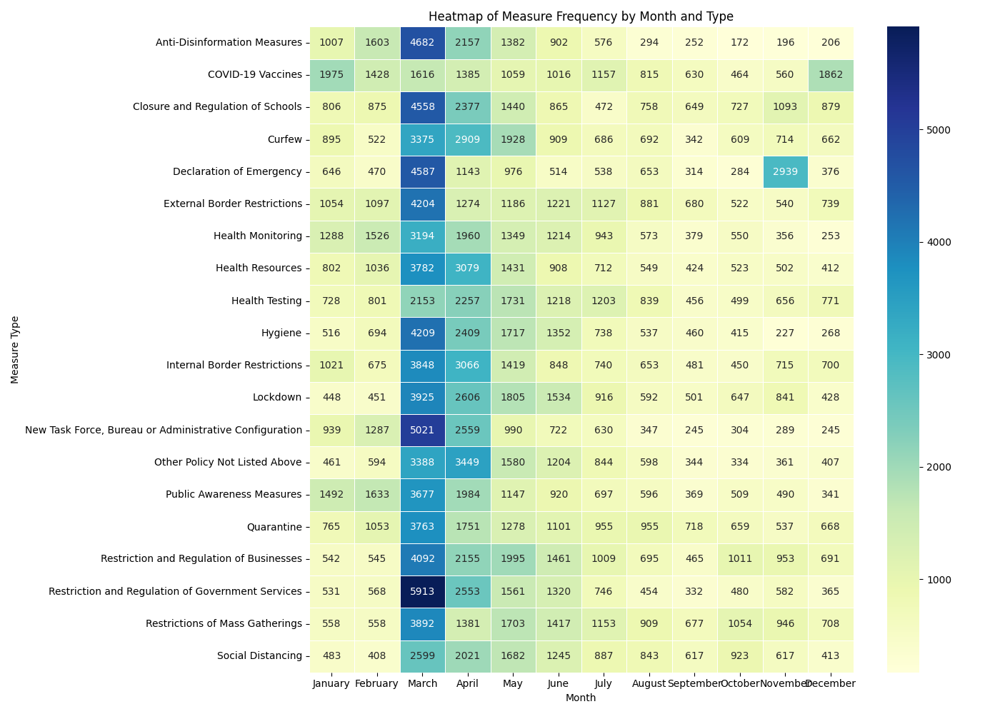
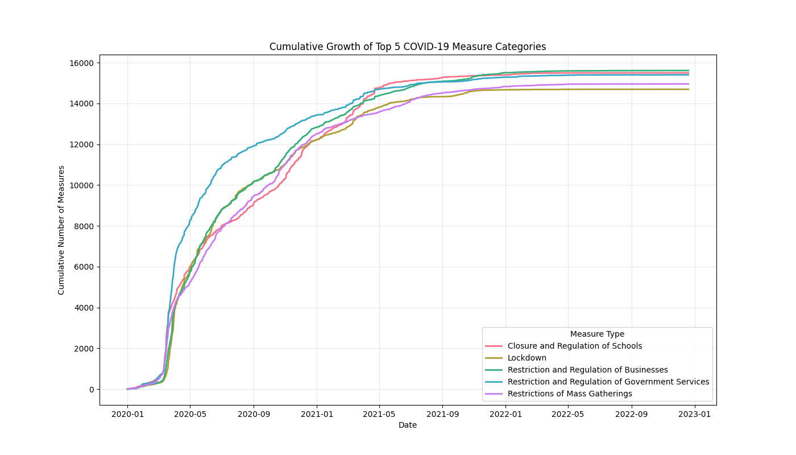
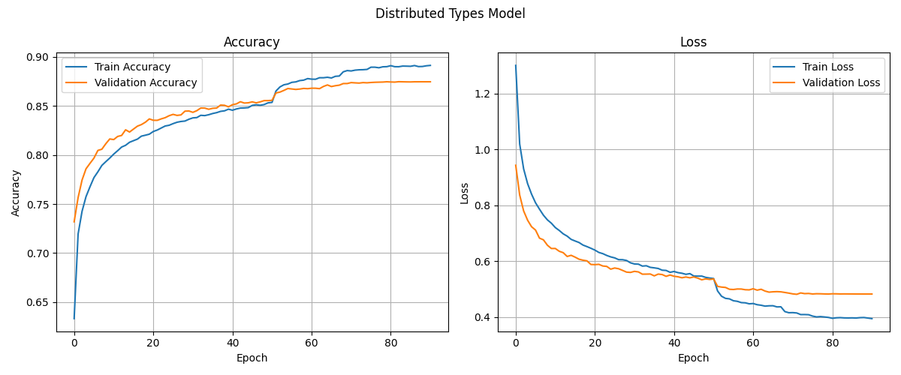
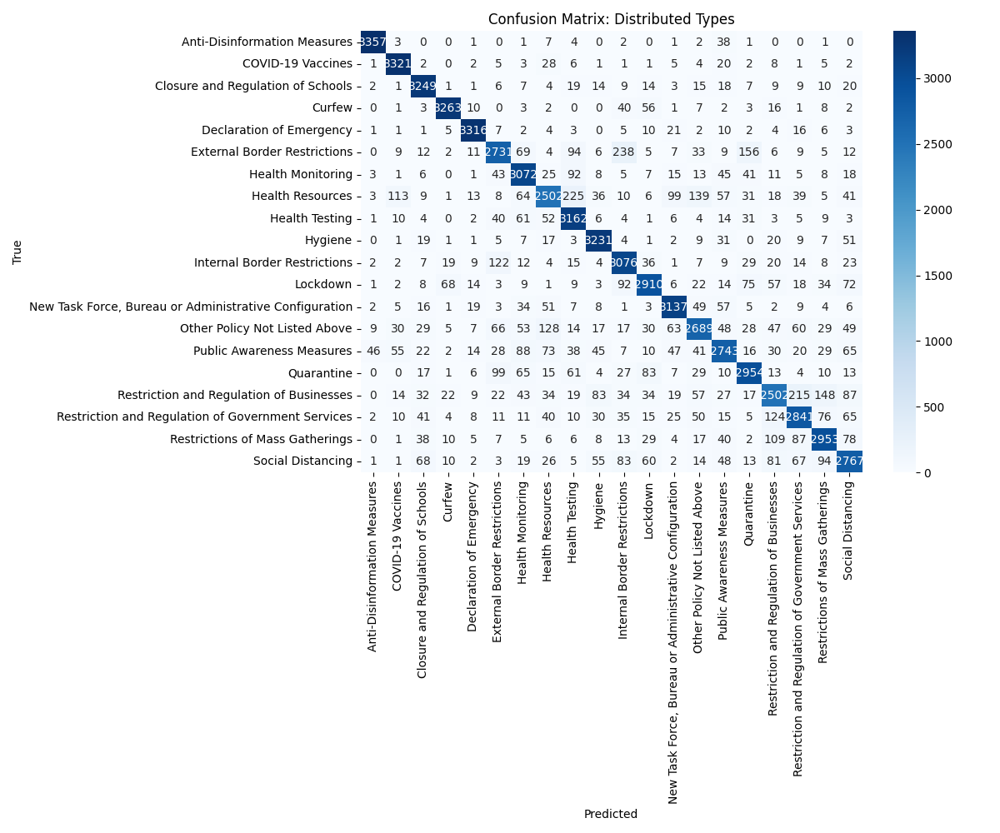

# ️ Audio-to-Topic Classification & Summarization System

## Authors

  - **Akram ElNahtawy**
  - **Bassam Hassan**
  - **Islam Fouad**
  - **Mahmoud Maher**
  - **Mai Farahat**
  - **Mohanad Sabry**

-----

## Live Deployment
**Try out live deployment on streamlit here: <br>
https://audio-to-topic-classification-summarization.streamlit.app/**

-----

## 1\. Project Overview

This project is a comprehensive end-to-end Machine Learning pipeline designed to process audio or text input, classify it into specific health and policy topics (e.g., "Vaccines", "Lockdown"), and generate concise summaries.

Unlike traditional sentiment analysis, this system leverages **OpenAI's Whisper** for high-fidelity transcription, **Sentence Transformers** for semantic embedding, and custom **Dense Neural Networks** for hierarchical classification. It addresses the challenge of organizing unstructured policy data into actionable insights via a dual-layer classification scheme (Specific vs. Generalized types).

-----

## 2\. Key Features

  * **Audio Transcription:** Integrated **Whisper** model to convert uploaded audio files (mp3, wav, m4a) into text.
  * **Dual-Layer Classification:**
      * **Distributed (Specific) Model:** Classifies text into 20 granular categories (e.g., "Social Distancing", "PCR Testing").
      * **Generalized Model:** Maps inputs to 6 broader categories (e.g., "Health", "Restrictions", "Economy").
  * **Intelligent Summarization:**
      * **Extractive:** Uses LSA (Latent Semantic Analysis) to pull key sentences.
      * **Abstractive:** Uses **BART-Large-CNN** to generate human-like summaries.
  * **Interactive Dashboard:** A **Streamlit** web application for real-time inference and visualization.

-----

## 3\. Directory Structure

The project follows a modular architecture separating data logic, model training, and application deployment.

```text
├── Dataset/
│   └── dataset_raw.csv        # Raw input data
├── Models/                    # Saved Keras models and Label Encoders
├── Visualizations/            # Generated charts and training history
├── src/
│   ├── data_preprocessing.py  # Cleaning, augmentation, and embedding logic
│   ├── model_training.py      # TensorFlow model architectures
│   ├── evaluation.py          # Metrics and plotting functions
│   ├── visualizations.py      # EDA generation
│   └── main.py                # Pipeline orchestrator
├── app.py                     # Streamlit Dashboard entry point
└── requirements.txt           # Project dependencies
```

-----

## 4\. Exploratory Data Analysis (EDA)

Before modeling, the pipeline performs a comprehensive analysis of the dataset to understand class balances, text characteristics, and temporal trends. The `visualizations.py` module generates the following insights automatically.

### A. Class Distribution & Balance

Understanding the spread of policy types is critical for handling imbalances.


*Figure 1: Distribution of different policy measure types across the dataset.*
### B. Textual Characteristics

We analyze the length of descriptions and common phrases to optimize the tokenizer and cleaning processes.


*Figure 2: Most frequent bigrams (two-word combinations) found in the text data.*


*Figure 3: Statistical distribution of text description lengths.*

### C. Temporal & Activity Trends

Analyzing when policies were implemented helps identify global waves of regulations.


*Figure 4: Timeline showing the frequency of measures implemented over time.*


*Figure 5: Cumulative growth of recorded policy measures.*

-----

## 5\. Technical Approach & Methodology

### A. Data Pipeline & Preprocessing

1.  **Text Cleaning:**
      * Removal of numbers, ordinals, and stopwords.
      * **Bias Mitigation:** Uses `pycountry` to strip specific country names, preventing the model from learning geographical biases.
      * Lemmatization using NLTK to reduce words to their root form.
2.  **Data Augmentation:**
      * Implemented to balance class distribution.
      * Techniques: Synonym Replacement (WordNet), Random Swap, and Random Deletion.
3.  **Vectorization:**
      * Utilizes `sentence-transformers/all-MiniLM-L6-v2` to create dense semantic embeddings (384 dimensions) rather than sparse TF-IDF vectors.

### B. Model Architectures

The system employs two distinct Feed-Forward Neural Networks (Dense) optimized for different granularity levels.

| Feature | Distributed Model (Specific) | Generalized Model (Broad) |
| :--- | :--- | :--- |
| **Classes** | 20 Classes | 6 Classes |
| **Architecture** | 5 Dense Layers with Dropout (0.2-0.3) | 3 Dense Layers with L2 Regularization |
| **Activation** | ReLU | GELU / ReLU |
| **Optimizer** | Adam (lr=1e-3) | AdamW (lr=3e-4, weight\_decay=1e-4) |
| **Callbacks** | ReduceLROnPlateau, EarlyStopping | EarlyStopping (Patience=4) |

### C. Summarization Engines

  * **Abstractive:** Leverages `facebook/bart-large-cnn` via HuggingFace pipeline for generating coherent, novel sentences.
  * **Extractive:** Uses `sumy.lsa` to identify and extract the most significant sentences from the transcript.

-----

## 6\. Installation & Setup

### Prerequisites

Ensure you have Python 3.8+ installed.

### Install Dependencies

```bash
pip install -r requirements.txt
```

*Note: You may need `FFmpeg` installed on your system for Whisper audio processing.*

-----

## 7\. Usage

### 1\. Training the Pipeline

To clean data, augment the dataset, train both models, and generate evaluation metrics:

```bash
python src/main.py
```

*Artifacts (models and graphs) will be saved to `Models/` and `Visualizations/` respectively.*

### 2\. Running the Dashboard

To launch the interactive web interface for uploading audio or testing text:

```bash
streamlit run app.py
```

-----

## 8\. Performance & Evaluation

The pipeline automatically generates evaluation metrics upon training:

### Training History


*Figure 6: Training and validation loss/accuracy for the Distributed Model.*

### Confusion Matrices


*Figure 7: Confusion Matrix for the 20-class Distributed Model, highlighting classification performance per category.*